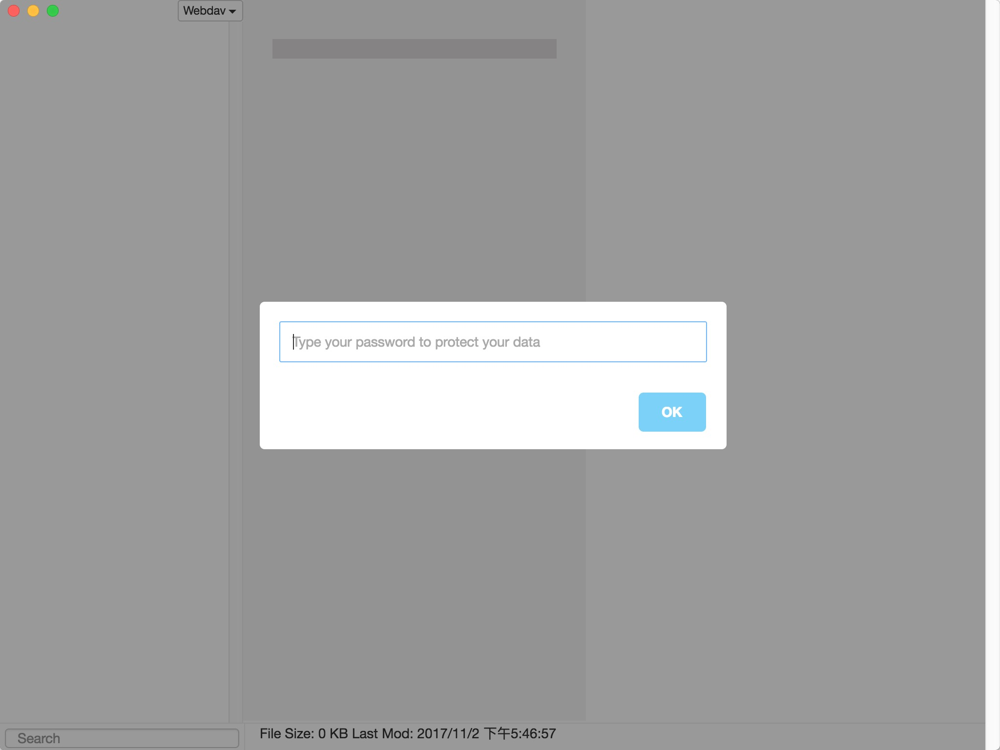
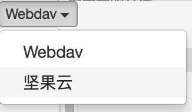
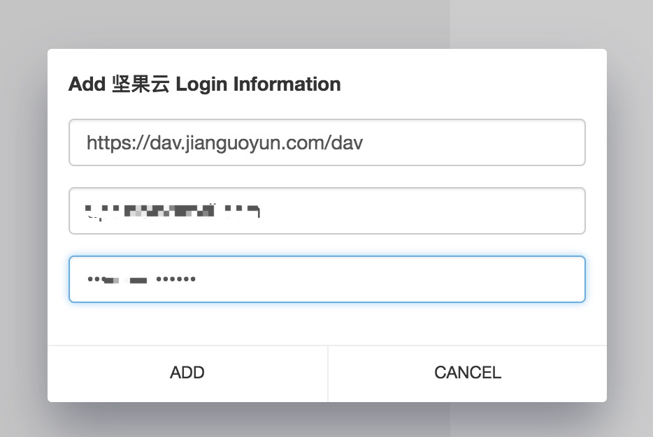
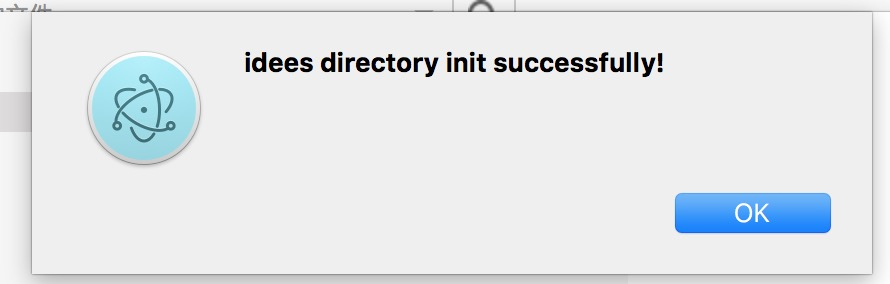
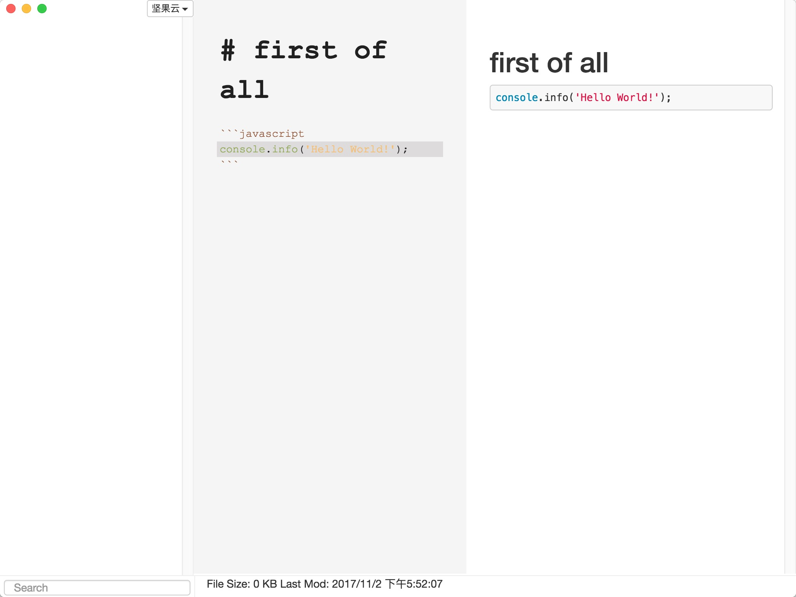
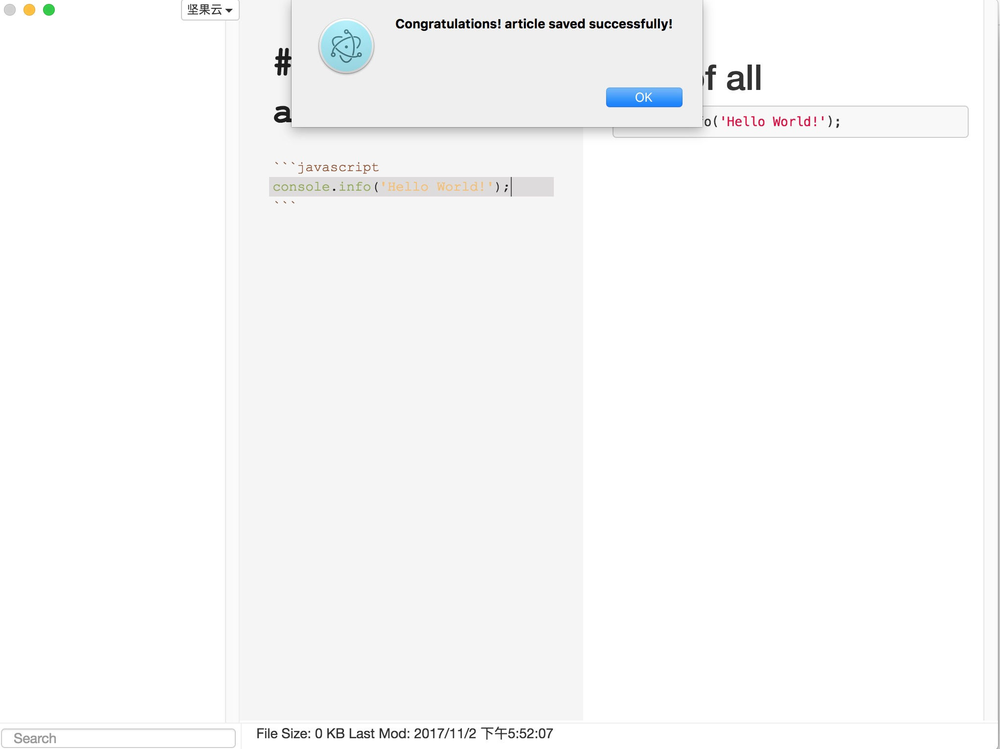
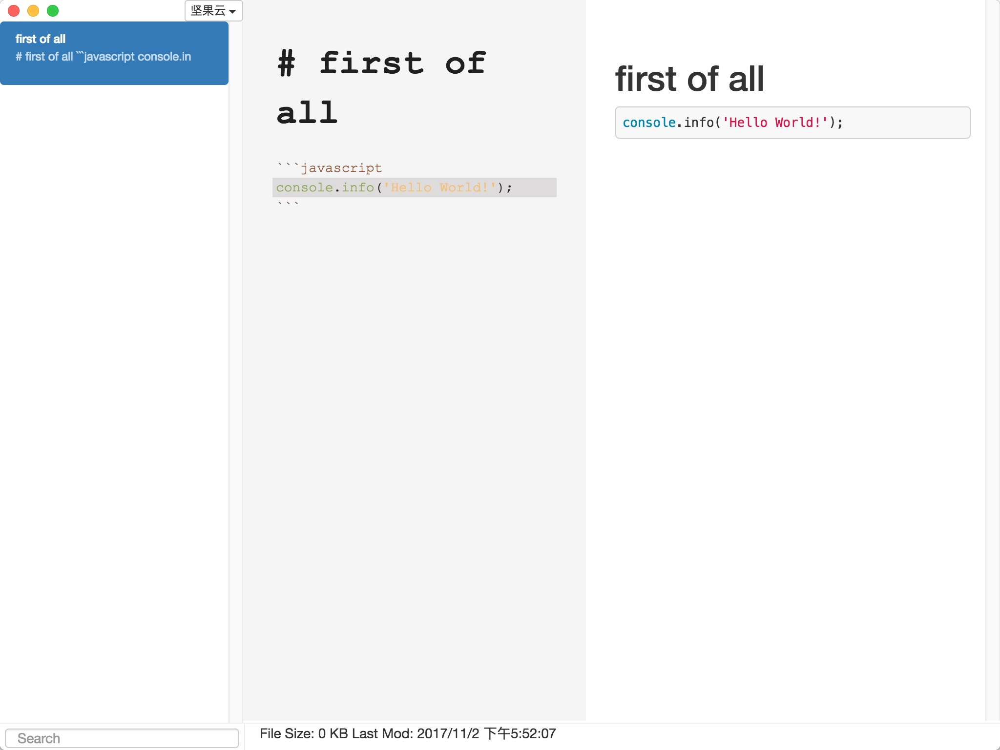

# Idees
  
A markdown editor which support several cloud file storage backends.

---

  

---

@[TOC]

## 0x01 What is Idees?
In our daily life, we have so many idées to write down, and many of us are suffering from the work of complicated text formatting.  
[Makrdown](https://github.com/topics/markdown) is a lightweight markup language which is a great way to save us from it.   
  
We usually save our data on many cloud file storage service, such as Dropbox, Google drive, 百度云, and so on. But what has happened did prove that these cloud storage is not reliable.  
They would  
* **peep your files**,   
* **block you download** your files due to their policy,   
* **delete your files**,   
* **leak out your secure files**.  

So we need a **self deployed file storage service**, like [Owncloud](https://github.com/owncloud/core), [Nextcloud](https://github.com/nextcloud/server)  
  
[Idees](https://github.com/idees/idees) is a **markdown editor** and support these **self deployed file storage services**.  
It named as idees which is the translate of ideas in French.  
It can catch your idées directly.  

## 0x02 Features
1. Full [Makrdown](https://github.com/topics/markdown) language support
2. Several cloud file backend: Local, [Webdav](https://en.wikipedia.org/wiki/WebDAV), [Owncloud](https://github.com/owncloud/core), [Nextcloud](https://github.com/nextcloud/server), [坚果云](https://www.jianguoyun.com/), and so on.  
3. Real time preview
4. Content searching

## 0x03 How to use
1. You should add a master password, which will secure your all configuration, and you'll be asked for this at anytime you open idees.  

2. Select a file storage service, such as [坚果云](https://www.jianguoyun.com/).   

3. Fill in the `remote_url`, `username` and `passowrd` you have in [坚果云](https://www.jianguoyun.com/).    
  
  
4. Press `CMD + N` to new a file.  
  
5. Insert file content.  
  
6. Press `CMD + S` to save the content.  
  
  

---  

## Article quotes
> * Accessing [Nextcloud](https://github.com/nextcloud/server) Files Using WebDAV
> [https://docs.nextcloud.com/server/9/user_manual/files/access_webdav.html](https://docs.nextcloud.com/server/9/user_manual/files/access_webdav.html)
> * Accessing [Owncloud](https://github.com/owncloud/core) Files Using WebDAV  
> [https://doc.owncloud.org/server/latest/user_manual/files/access_webdav.html](https://doc.owncloud.org/server/latest/user_manual/files/access_webdav.html)
